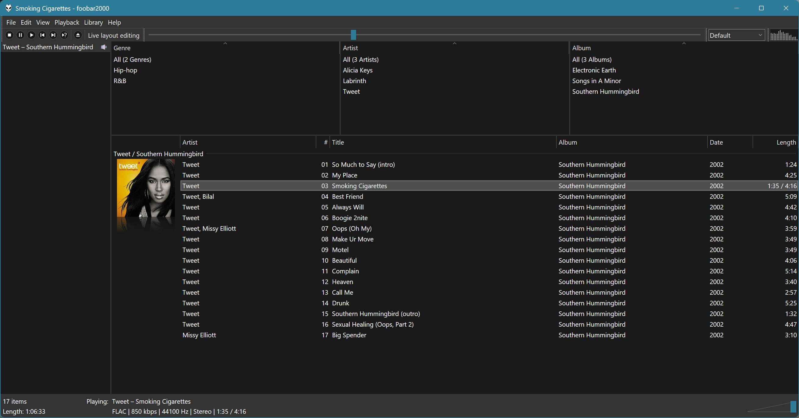

# Columns UI



Columns UI is an alternative UI for the Windows version of the
[foobar2000 audio player](https://www.foobar2000.org), with interchangeable
panels and toolbars.

Its features include:

- a dark mode on Windows 10 and 11
- a playlist view with grouping, artwork and in-line metadata editing
- [DirectWrite text rendering](https://en.wikipedia.org/wiki/DirectWrite) in
  most built-in panels, including colour emoji support
- colour management for artwork
- support for SVG icons in the buttons toolbar via
  [SVG services](https://github.com/reupen/svg-services)
- item details and properties panels to view detailed track information

## Requirements

To use Columns UI, you need:

- Windows 7 Service Pack 1 with the Platform Update, or newer
- foobar2000 1.5 or newer

## Downloads

### Releases

Stable and pre-release versions can be downloaded from the
[Columns UI home page](http://yuo.be/columns-ui).

### Development versions

> [!WARNING]
> [32-bit development builds are broken.](https://github.com/reupen/columns_ui/issues/1335)

If you’re logged into GitHub, you can download the latest development version by
visiting the
[list of recent GitHub Actions builds](https://github.com/reupen/columns_ui/actions/workflows/build.yml?query=branch%3Amain),
clicking on the most recent entry with a green tick, and then scrolling down to
the links named ‘Component package (release, win32)’ and ‘Component package
(release, x64)’ at the bottom.

Development versions may be buggier than formal releases; if you encounter a
problem, open an issue.

## Source code licence

The source code of Columns UI is released under the GNU Lesser General Public
License (LGPL) version 3.

## Development

[](https://github.com/reupen/columns_ui/actions/workflows/build.yml?query=branch%3Amain)
[](https://results.pre-commit.ci/latest/github/reupen/columns_ui/main)
[](https://www.codacy.com/gh/reupen/columns_ui/dashboard)

To clone the repo and dependencies,
[download and install Git](https://git-scm.com/downloads), and then run:

```powershell
git clone --recursive https://github.com/reupen/columns_ui.git
```

This repo makes use of Git submodules. If you're not familiar with them,
[see the guide here](https://git-scm.com/book/en/v2/Git-Tools-Submodules).

### Build instructions

> [!WARNING]
> [Version 14.44 of the Visual Studio C++ build tools can’t be used for 32-bit builds.](https://github.com/reupen/columns_ui/issues/1335)

To build Columns UI, you need:

- Visual Studio 2022
- Windows 11 SDK, version 10.0.26100.0 or newer
- [vcpkg](https://github.com/Microsoft/vcpkg)
- Python 3.12 (including the `py` launcher)

#### Installing Visual Studio

[Download Visual Studio 2022](https://www.visualstudio.com/downloads/). During
installation, select the Desktop development with C++ workload and version
10.0.26100 or newer of the Windows 11 SDK from the right-hand side.

#### Installing vcpkg

You can install and set up vcpkg by running the following commands (in a
directory of your choice outside the Columns UI source tree):

```powershell
git clone https://github.com/Microsoft/vcpkg.git
vcpkg\bootstrap-vcpkg.bat
vcpkg\vcpkg integrate install
```

Dependencies will then be automatically installed when Columns UI is built.

(You’ll need to occasionally run `git pull` in the vcpkg directory to fetch
updated package metatdata.)

#### Building using the Visual Studio IDE

Open `vc17/columns_ui-public.sln` in Visual Studio 2022.

Select the Release configuration and a platform (Win32 or x64), and build the
solution.

If the build is successful, `foo_ui_columns.<architecture>.fb2k-component` will
be output in `vc17\release-<platform>-v143`.

#### Building using MSBuild on the command line

You can use MSBuild if you prefer. To build a 32-bit component, start a
Developer Command Prompt for VS 2022 (from the start menu), and run:

```powershell
msbuild /m "/p:Platform=Win32;Configuration=Release" vc17\columns_ui-public.sln
```

If the build is successful, `foo_ui_columns.x86.fb2k-component` will be output
in `vc17\release-win32-v143`.

For a clean build, run:

```powershell
msbuild /m "/p:Platform=Win32;Configuration=Release" "/t:Rebuild" vc17\columns_ui-public.sln
```

##### Using the Clang compiler (experimental)

<details>

<summary>Instructions for building with Clang</summary>

Columns UI can be also compiled using the version of Clang distributed with
Visual Studio.

(Note that Clang is not installed by default – in the Visual Studio 2022
installer, you will need to select the Clang compiler and the Clang build tools
components.)

With these installed, open a Developer Command Prompt for VS 2022 from the start
menu, switch to the Columns UI source directory and run:

```powershell
msbuild /m "/p:PlatformToolset=ClangCL;LinkToolExe=link.exe;VcpkgAutoLink=true;Platform=Win32;Configuration=Release" vc17\columns_ui-public.sln
```

(Note: Currently `lld-link.exe` can't be used due to
[missing wildcard support](https://github.com/llvm/llvm-project/issues/38333).)

</details>

#### Building a release package

A universal release package (containing x86 and x64 build) can be created by
running:

```
py scripts\build-release-package.py
```

If successful, a component package will be created in the `component-packages`
directory.

(A Visual Studio Developer Command Prompt is not required to run the script.)

### Documentation site

This repo also includes the source for a
[documentation site](https://columns-ui.readthedocs.io) in the `docs` directory.
See [docs/README.md](./docs/README.md) for more information.
